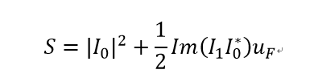

# Pupil-filtering-super-resolution
Design and optimize a super-resolution pupil filter and verify it in optical system, image restoration by improved Deblurganv2
## 1. Design and optimize a super-resolution pupil filter

 

 
fig.1 airy disk definition  

 

 
fig.2 super-resolution optical system  

Strehl ratio:

 

Super-resolution index:

 

Amount of shift in focus:

 

 

 fig.3 multi-zone pupil filter 

Optimize different super-resolution pupil filters by Genetic Algorithm.
## 2. Verify the phase design in optical system

 

fig.4 three-zone pupil filter 

Get results and put pupil filters into optical system in Zemax,and then varify super-resolution index
by calculating widthes of PSF.

 

fig.5 MTF and PSF  

## 3. Simulate imaging and construct the dataset
Get PSF from optical system to complete image simulation.

 

fig.6 image simulation 

## 4. Image restoration by improved Deblurganv2

 

fig.7 Deblurganv2 

## 5. Experiment 

