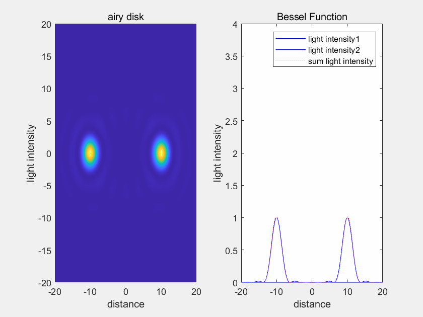
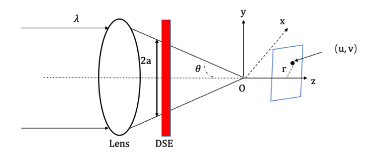
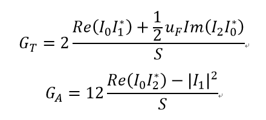
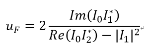
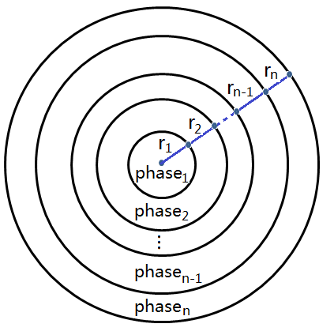
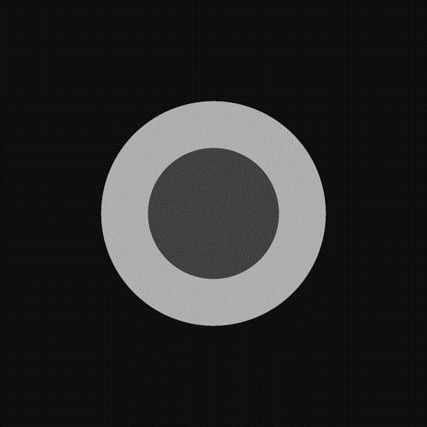
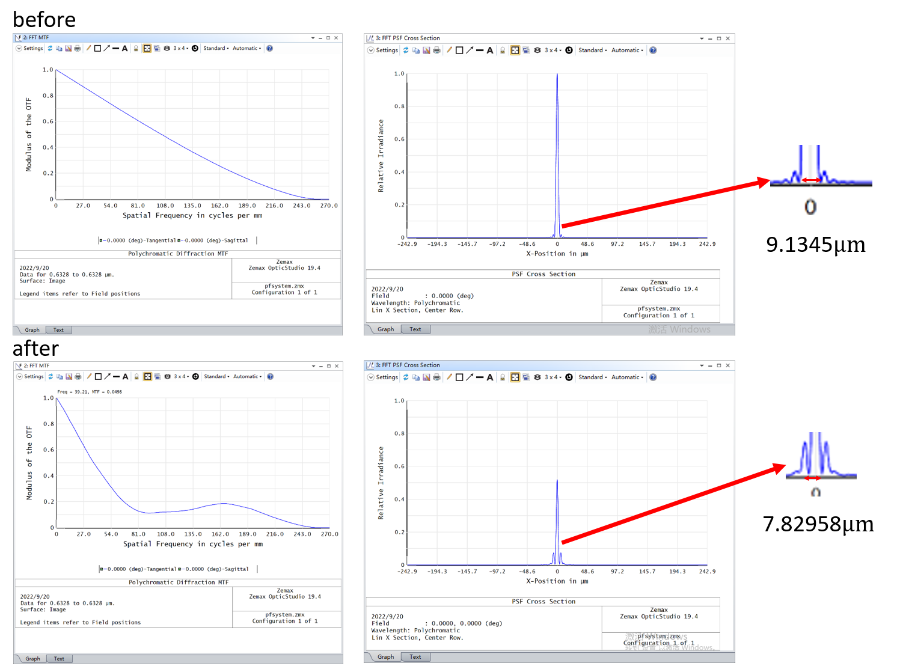
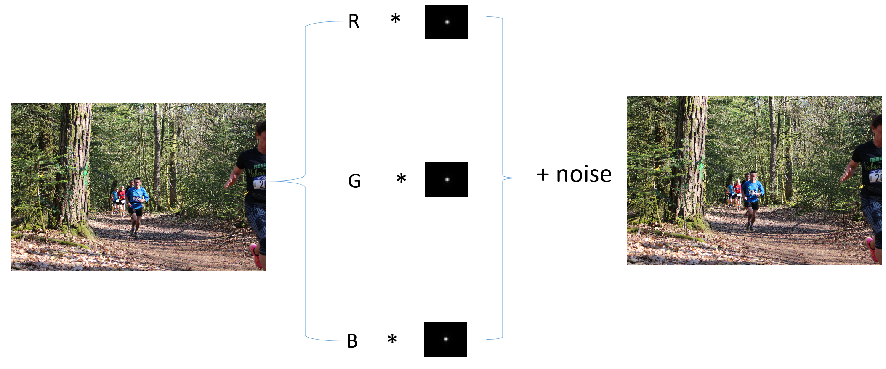
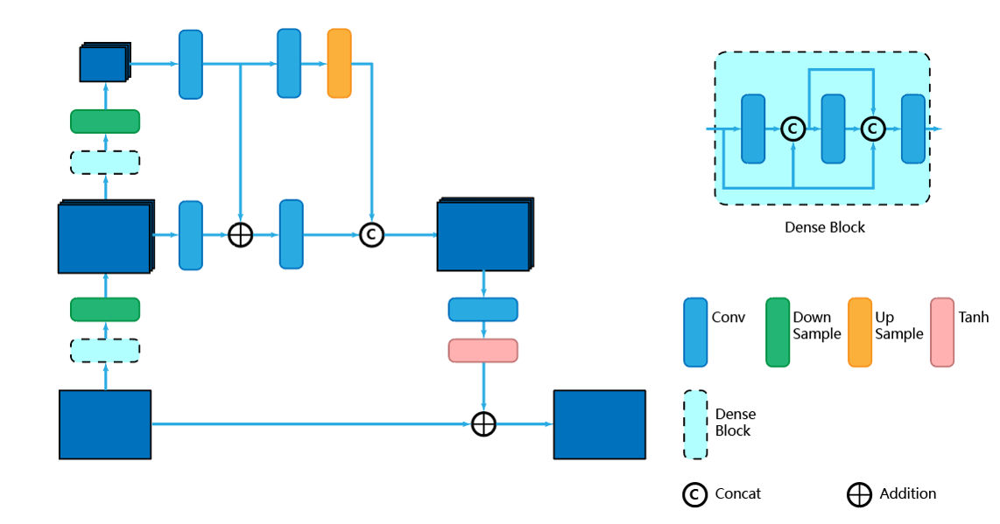

# Pupil-filtering-super-resolution
Design and optimize a super-resolution pupil filter and verify it in optical system, image restoration by improved Deblurganv2
## 1. Design and optimize a super-resolution pupil filter

  

 fig.1 airy disk definition 

 fig.2 super-resolution optical system 

 fig.3 Strehl ratio 

 fig.4 super-resolution index 

 fig.5 the amount of shift in focus 

 fig.6 multi-zone pupil filter 

Optimize different super-resolution pupil filters by Genetic Algorithm.
## 2. Verify the phase design in optical system

 fig.7 three-zone pupil filter 

Get results and put pupil filters into optical system in Zemax,and then varify super-resolution index
by calculating widthes of PSF.

 fig.8 MTF and PSF  

## 3. Simulate imaging and construct the dataset
Get PSF from optical system to complete image simulation.

 fig.9 image simulation 

## 4. Image restoration by improved Deblurganv2

 fig.10 Deblurganv2 

## 5. Experiment 

